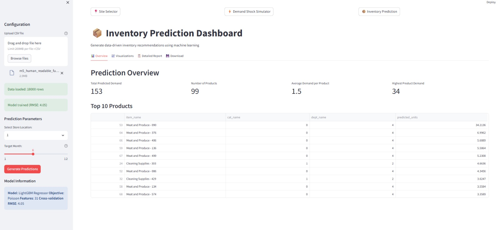
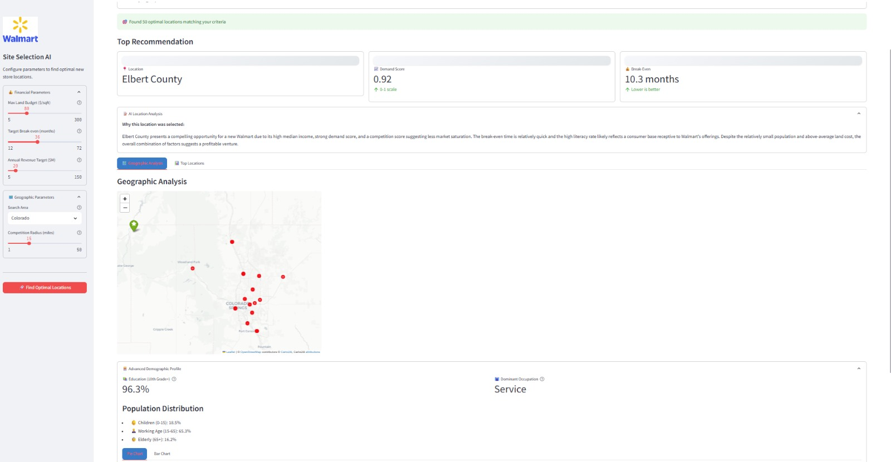

 Walmart Locator & Analytics Suite

A comprehensive Streamlit-based analytics suite for Walmart site selection, demand simulation, and inventory prediction. This project leverages demographic, financial, and competitive data to help identify optimal new store locations, simulate demand shocks, and predict inventory needs.

 Features

- Site Selector AI:  
  Pinpoints high-revenue potential locations for new Walmart stores using grid search, demographic, and financial analysis.
- Demand Shock Simulator:  
  Simulates the impact of demand shocks on candidate locations.
- Inventory Prediction Dashboard:  
  Predicts inventory requirements using advanced time-series and machine learning models.
- Interactive Visualizations:  
  Folium and Plotly-based maps and charts for intuitive exploration of results.

  

 Directory Structure

<pre>
walmart_locator_rhn/
├── analysis_engine.py
├── config.yaml
├── constants.py
├── debug.py
├── debug_gemini.py
├── enhancedintegratedapp.py
├── explainer_service.py
├── integratedapp.py
├── inventory_app.py
├── main.py
├── prodmain.py
├── requirements.txt
├── test_census.py
├── walmart_full_synthetic_data.csv
├── walmart_shock_simulated_data.csv
├── walmart.png
├── data/
│ ├── external/
│ ├── processed/
│ └── raw/
├── models/
│ └── demand_model.joblib
├── utils/
│ ├── config_manager.py
│ ├── data_fetcher.py
│ ├── geo_utils.py
│ ├── model_utils.py
│ ├── test_census.py
│ └── visualization.py
</pre>

 Installation

1. Clone the repository:
   bash
   git clone <repo-url>
   cd walmart_locator_rhn
   

2. Install dependencies:
   bash
   pip install -r requirements.txt
   

3. Configure API keys:
   - Edit config.yaml to add your Census and Gemini API keys.

 Usage

 Site Selector App

bash
streamlit run main.py

- Configure parameters in the sidebar (budget, break-even, region, etc.)
- Click "Find New Locations" to run the analysis.
- View candidate sites, demand scores, and detailed explanations.

 Inventory Prediction Dashboard

bash
streamlit run inventory_app.py

- Upload or use provided sales data.
- Explore inventory forecasts, trends, and visualizations.

 Integrated/Enhanced Apps

bash
streamlit run integratedapp.py
 or
streamlit run enhancedintegratedapp.py

- Access all features (site selection, demand simulation, inventory) from a single interface.

 Configuration

- config.yaml:  
  Set analysis defaults, API keys, and visualization options.
- constants.py:  
  Edit or extend supported states, Census variables, and land price ranges.

 Data

- Place raw, processed, or external data in the data/ directory.
- The app can generate synthetic data if real data is missing.

 Dependencies

See requirements.txt for the full list. Key packages:
- streamlit, folium, streamlit-folium, pandas, numpy, scikit-learn, plotly, requests, geopy, joblib, PyYAML

 Extending

- Add new states or regions in constants.py and analysis_engine.py.
- Plug in new models via utils/model_utils.py.
- Customize visualizations in utils/visualization.py.

